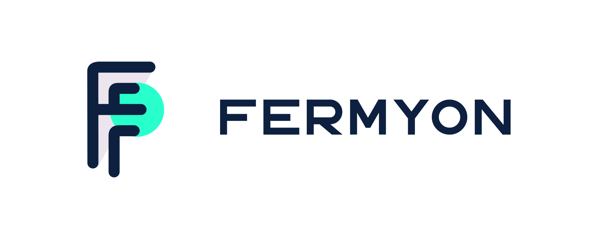

name: Spin Fundamentals
class: center,middle,title-slide
count: false

.titletext[
Spin Fundamentals]
Comprehensive course on using Fermyon Spin

???
<!---
Spin Fundamentals

This slide presentation is stored as Markdown code, specifically using the RemarkJS engine to render it. All standard markdown tags are supported, and you can also use some HTML within this document. 

If you need to change the look and feel of the slide deck just use the style.css and remark_settings.js files to suit your needs. The content in this file is picked up by index.html when the page is loaded.

HTML comments like this one will show up in the source code, but not in the slides or speaker notes.
--->

Welcome to Spin Fundamentals. This slide deck is written entirely in Markdown language, which means you can make edits or additions, then submit a pull request to add your changes to the master copy. To make edits to the slide deck simply fork this repository:  

https://github.com/fermyon/spin-fundamentals  

edit the Markdown files, and submit a pull request with your changes.

The Markdown content is contained in the docs/terraform and docs/vault directories.

Here are some helpful keyboard shortcuts for the instructor or participant:  

⬆ ⬇ ⬅ ➡ - Navigate back and forth  
P         - Toggle presenter view  
C         - Pop an external window for presentation

Instructor notes are included in plain text, narrative parts are in **bold**. You can use the narrative quotes or change them to suit your own presentation style. 

---
name: Link-to-Slide-Deck
The Slide Deck
-------------------------
   
.center[
Follow along on your own computer at this link:

https://training.fermyon.app
=========================
]

---
name: Introductions
Introductions
-------------------------

???
Introduce yourself

---
name: Introductions
Introductions
-------------------------
     
.center[.lab-header[Everyone Stand up]]

???
Have everyone stand up. Then ask those whom to continue standing whom have:
- Used serverless functions
- Used WebAssembly
- Used Fermyon Spin
- Used Fermyon Cloud

Then ask everyone to sit. Ask anyone to raise their hands if they have used any other specific serverless tools such as Lambda or Azure Functions. Depending on th size of the group, ask them each tool individually, or inquire to the individuals with their hands raised what they have used.

---
name: Table-of-Contents
class: center,middle
Table of Contents
=========================

.contents[
1. Intro to Fermyon Spin
2. XXX
]

???
This workshop should take roughly four hours to complete. It is ideal for a half-day workshop. 

**Here is our agenda for today's training. We'll be taking breaks after each major section or every hour, whichever comes first. This part of the workshop will take us through lunch break, then we'll cover Vault during the afternoon session.**

---
name: How-to-Provision-a-VM
How to Provision an Azure VM
-------------------------
   

Let's look at a few different ways you could provision a new Azure Virtual Machine. Before we start we'll need to gather some basic information including:

.biglist[
1. Virtual Machine Name
2. Operating System (Image)
3. VM Size
4. Geographical Location
5. Username and Password
]

???
**Has anyone got experience using Azure? How do most of us normally get started? That's right, we log onto the Azure Portal and start clicking around. All of the major cloud providers make this part really easy. You get your account, log on and start clicking buttons. Let's take a peek at what that looks like...**

